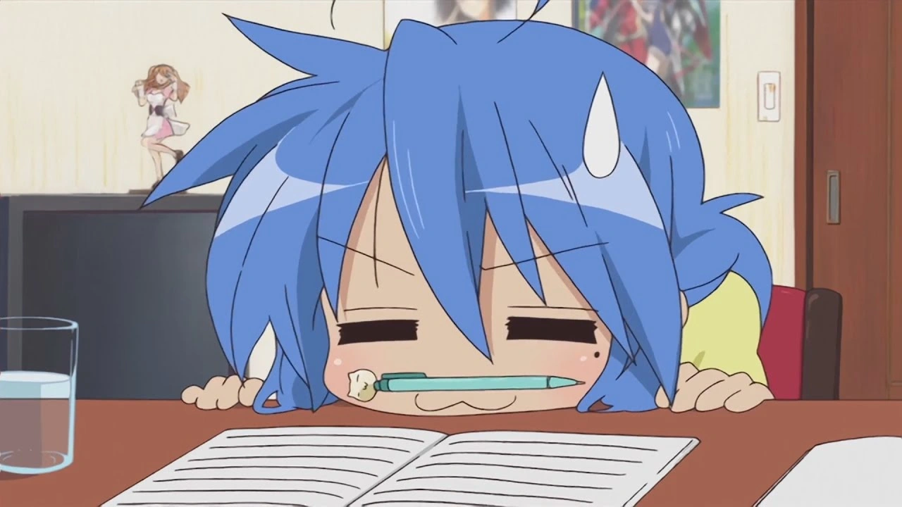
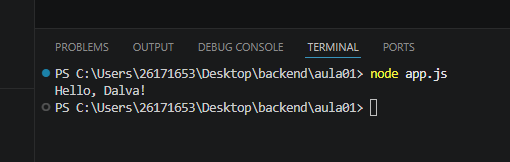

<!-- Dalvaaaa -->
<!--- Made by yenkarii/"Guilherme Antonio" -->
<!-- TOTALLY PERFECT DAY -->
# Meu primeiro projeto em JavaScript


# Aluno

Nome: Yen Aneki

Turma: DS1A

Professor: Vitor Lima

---

## Sobre

Este projeto foi desenvolvido durante a primeira aula de JavaScript.

O objetivo foi aprender:
- Utilizar o VSCode;
- Executar o JavaScript com Node.js;
- Utilizar o Terminal (Powershell, CMD);
- Criar documento utilizando Markdown

---
## Estrutura

```
MeuPrimeiroProjetoJS
|
|-app.js
|-informacoes.js
|-operadores.js
|-variavel.js
|-readme.md
|-imagem
    |-image.png
```

## Como executar

### BASH
```bash
node app.js
```

## Código

### JAVASCRIPT
```javascript
console.log("Hello, Dalva!");
```

## Resultados


## Tecnologia
- JavaScript;
- Node.js;
- Visual Studio Code;
- Markdown

## O que aprendi
- Criar arquivos JavaScript;
- Executar programas em .js;
- Utilizar terminal;
- Criar o README;
- Instalar extensões;
- Utilizar o Markdown;
- GIT
- Operadores

